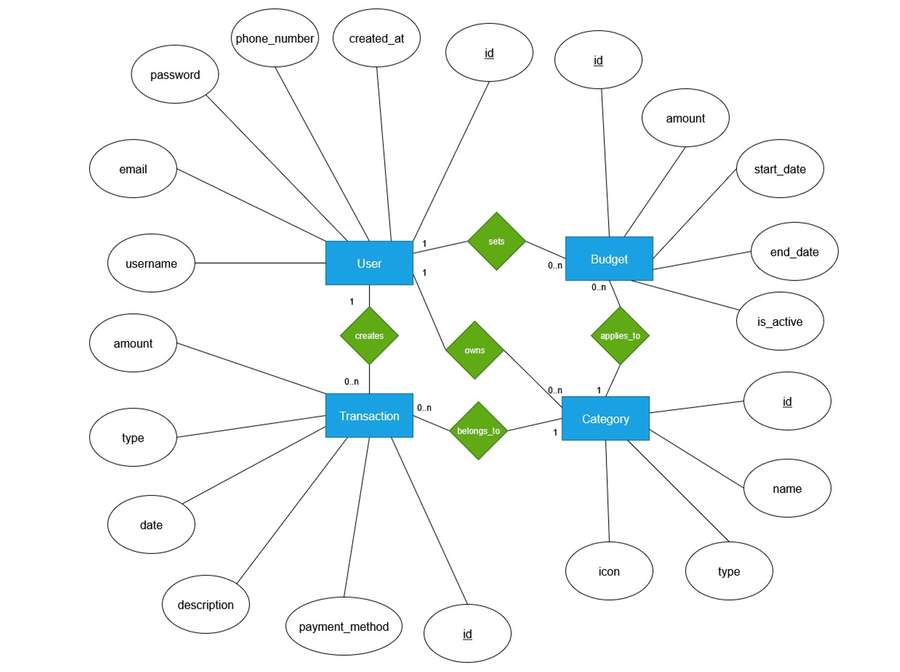
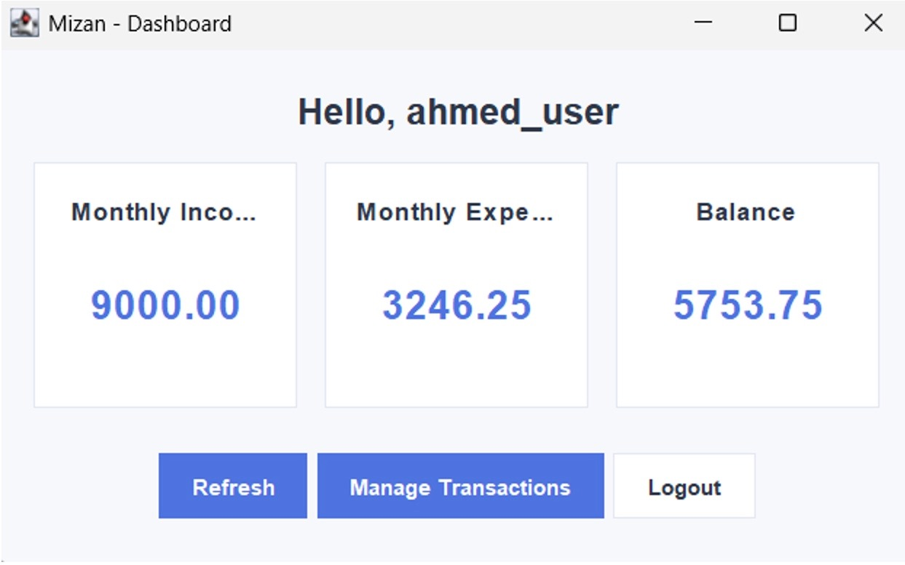
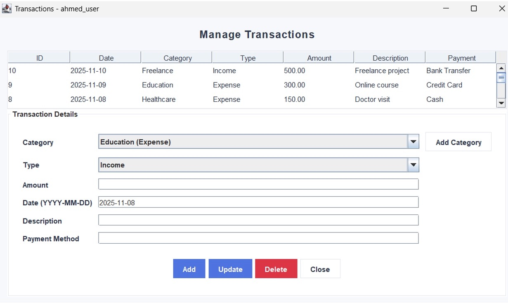

# Mizan - Personal Finance

Mizan is a personal finance management application built with Java and MySQL. It allows users to manage their finances by tracking income and expenses, organizing transactions into categories, and monitoring their monthly financial activity.

## Features

- User registration and login
- Income and expense tracking
- Transaction management
- Custom transaction categories
- Monthly income, expenses, and balance overview
- Add, update, and delete transactions

## Technologies

- Java
- MySQL
- SQL
- JDBC
- NetBeans

## Database Structure

The Mizan database consists of four main entities:

- User
- Transaction
- Category
- Budget

The database uses primary and foreign keys to maintain relationships between users, transactions, categories, and budgets.

### Enhanced Entity Relationship Diagram (EERD)

## Application Screenshots

### Dashboard

The dashboard provides an overview of the user's monthly income, expenses, and current balance.

### Transaction Management

Users can view, add, update, and delete transactions, as well as organize them into categories.

## Project Structure

- `Mizan/` - Java application source code and NetBeans project files
- `mizan.sql` - MySQL database schema and data
- `README.md` - Project documentation

## Team

- Norah Alfayez
- Reema Alkheraif
- Mashael Aljarbou
- Jana Altalhi

## Course

CS 340 - Introduction to Database Systems  
Prince Sultan University
